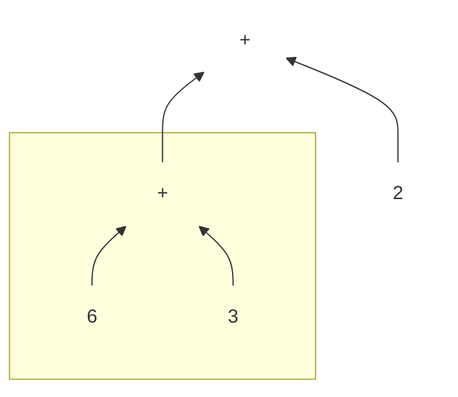
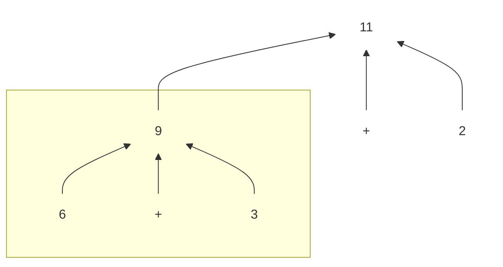
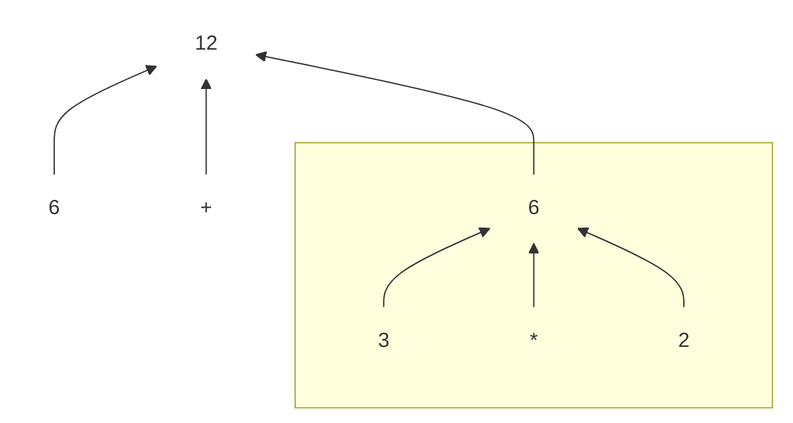

# Arithmetic Operation

[Assignment 연산자(Operator), 이항(Binary) 연산자, 단항(Unary) 연산자][op1][^op1]로 복잡한 산술 계산(Evaluation) 과정을 표현할 수 있습니다.

- 여러 연산자(Operator)를 써서 복잡한 식(Expression)을 적을 수 있습니다.

```java
6 + 3 * 2
```

- 연산자 우선순위(Operator Precedence)가 없다면 위 식을 계산하는 과정에서 어떤 문제가 생기나요?

```java
6 - 3 - 2
```

- 연산자 결합 규칙(Associativity)이 없다면 위 식을 계산하는 과정에서 어떤 문제가 생기나요?

```
- 6 * 3 / 2
```

- 문제를 없애는 규칙은 무엇입니까?
- 결합 규칙이나 우선순위를 바꾸고 싶을 때 '()'를 쓸 수 있습니다.

```java
6 * (3 / 2)
(6 + 3) * 2
```

- 복잡한 식은 읽고 고치기가 어려운 경우가 있습니다. 그 때문에 계산 순서가 또렷이 드러나도록 '()'를 치기도 합니다.

<!-- TODO: 설명에 더 알맞은 보기가 필요 -->

```java
-(-(-6 * 3)) / 2
```

- 하지만 '()'를 너무 겹쳐 쓰면 도리어 읽기 어렵습니다. 위 식은 아래처럼 간추려 적는 게 낫습니다.

```java
-6 * 3 / 2
```

## 연습

산술식(Arithmetic Expression) `-5 / 2`의 계산 결과를 stdout으로 보내는 [Application](ArithmeticExpressionEvaluation.java)으로 시작합니다.

- 아래 식으로 같은 실험을 되풀이하며 코드를 한 단락씩 늘립니다.
  1. 돌려 보기 전에 식의 계산 결과와 data type을 comment에 적습니다.
  1. 예측한 결과와 계산한 결과가 모두 같은지 확인합니다.

```java
-5 % 2
-5 % 2f
-5.0 % -2.0
4.0f / 2.0
5.0 / 2.0
```

- 아래에서 산술식이 아닌 것을 모두 고릅니다.

```java
year // int year = 1969;
1987
(double) i // int i = 2;
(int) d   // double d = 2.0;
x = (y = 5) // int x =0, y = 0;
x = y = 5
```

- 아래 식에서 error가 나는 이유를 설명합니다.

```java
++value++
```

## Expression Tree

산술식의 구문 구조(syntactic structure)를 abstract syntax tree(AST, syntax tree)로 나타낼 수 있습니다. Expression의 syntax tree를 expression tree라고 합니다.

```
6 + 3 + 2
```



이항 연산자의 왼 결합 규칙이 나무 구조 속에 또렷이 드러납니다.

## Evaluation

Expression tree를 타고 오르며 계산(evaluation)하는 과정을 그릴 수 있습니다.



펼쳐진 생김새가 나무 모양이라 Tree accumulation이라고 합니다.

## 연습

```
6 + 3 * 2
```



왼 결합 규칙을 따르면서도 연산자 우선순위에 따라 곱셈(*)식의 값부터 먼저 구하는 과정이 드러납니다.

- 위와 같은 계산 과정이 펼쳐지도록 expression tree를 그리세요.
- 아래 expression의 expression tree와 evaluation tree를 그리세요.

```
6 / 3 * 2
(6 + 3) * 2
6 + (3 * 2)
- 6 * 3 / 2
```

<!-- 각주 -->
[^op1]: 컴퓨터 프로그래밍이 처음이라면 문서에 있는 코드를 한 단락씩 적고 돌려보면서 언어와 도구에 익숙해지는 시간을 갖습니다.

<!-- 링크 -->
[op1]: https://docs.oracle.com/javase/tutorial/java/nutsandbolts/op1.html
